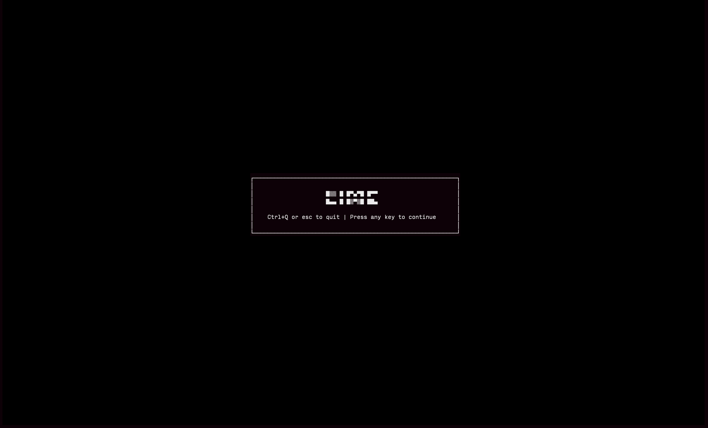

# LIME - Simple Lightweight editor

(Still under development)



### Installation
```
$ git clone github.com/DeeStarks/lime && \
$ cd lime && make
```

### Usage
- `./lime <filename>`: start the editor